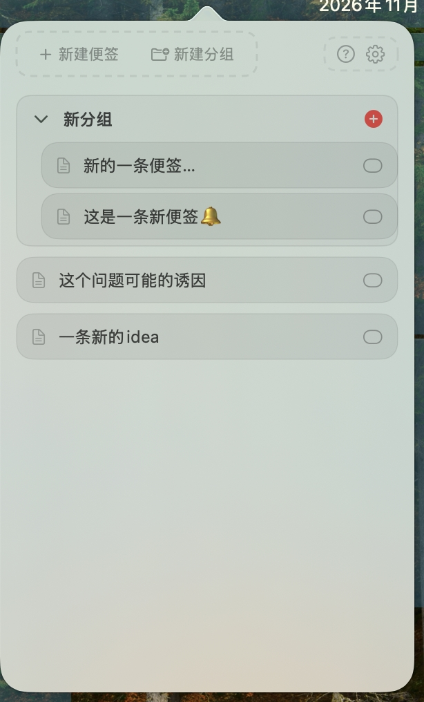
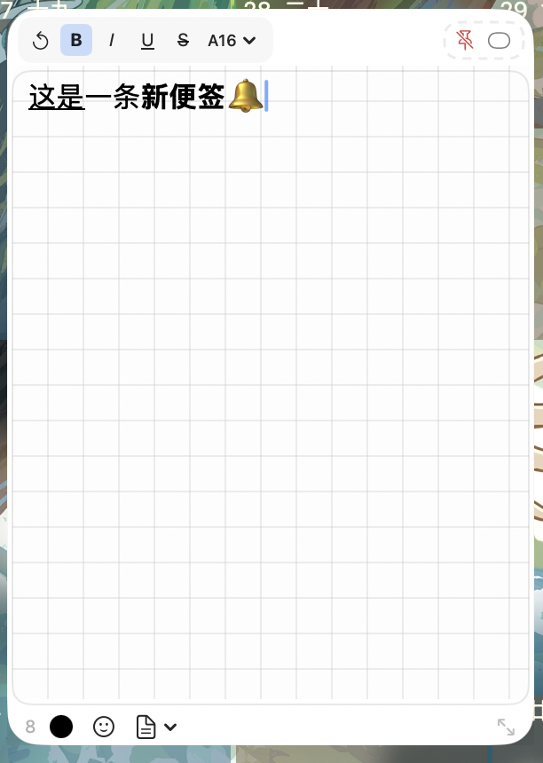

<p align="center">
  
</p>

# PinNote

macOS 菜单栏便签 App。极简圆角卡片风格，支持分组、钉到屏幕、胶囊模式。

## 功能

- **菜单栏界面**：新建便签 / 新建分组，点击便签弹出悬浮窗；便签支持拖入 / 拖出分组；一键吸附屏幕边缘按钮

----
<p align="center">
  
</p>

----

- **悬浮窗**：富文本编辑（粗体 / 斜体 / 下划线 / 删除线 / 字号下拉 / 49 色 / emoji），编辑框实时显示字符数
- **编辑区背景**：空白页、点阵页、虚线格、网格本、木质纹理，一键切换并记住选择
- **钉住**：窗口钉在屏幕并保持最前（全屏切换也不掉）；初次钉住吸附屏幕左侧、以最小尺寸打开，之后记住每次调整的位置和大小

----
<p align="center">
  
</p>

----

- **胶囊模式**：悬浮窗变为半圆胶囊吸附屏幕左 / 右边缘（按悬浮窗所在半屏决定），不同便签显示不同颜色圆点；悬停展开预览，拖拽后记住吸附位置，点击恢复悬浮窗

----
<p align="center">
  
</p>

----


- **设置**：开机自启动、数据导出 / 导入

## Requirements

- macOS 14.0 or later
- Apple Silicon or Intel (build with `ARCHS="arm64 x86_64"` for Intel support)

## 构建

```bash
bash build.sh
```

生成 Xcode 工程，编译并打包 DMG。如需重新生成应用图标：

```bash
bash generate_icon.sh
```

## 快捷键

| 快捷键 | 功能 |
|--------|------|
| ⌘N | 新建便签 |
| ⇧⌘N | 新建分组 |
| ⌘W | 关闭弹窗 |
| ⌘, | 设置 |
| ⌘/ | 帮助 |
| ⌘M | 悬浮窗切换为胶囊模式 |

## License

MIT

## Support

If you find DueDay helpful, consider supporting its development:


- **感谢赞助** — 如果DueDay对你有帮助，欢迎扫码赞助一杯咖啡 ☕

- <p align="center">
  
  
</p>


Your support helps cover developer costs and motivates continued improvement. Thank you! 🙌
